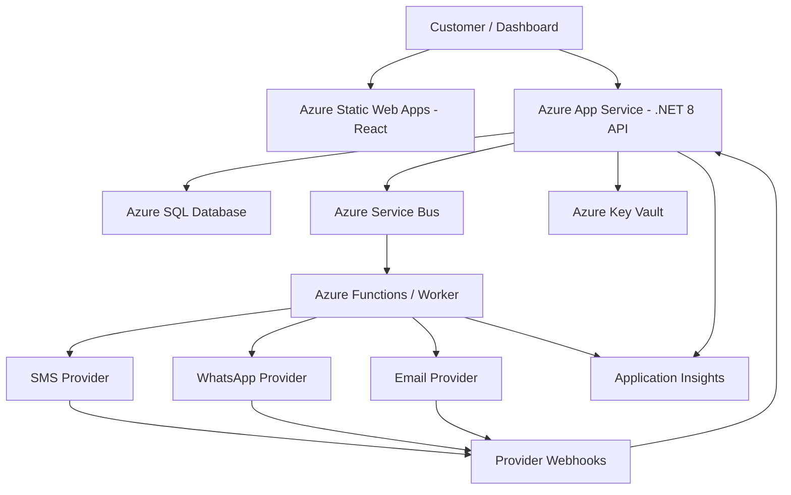

# Architecture

## Message flow

1. API authenticates the tenant and validates the request.
2. Message is persisted as queued.
3. API publishes a command to Service Bus.
4. Worker selects the channel provider and sends the message.
5. Provider response is persisted.
6. Provider webhook updates delivery status.
7. Dashboard reads the resulting status and usage.

Provider credentials belong in Azure Key Vault. Never commit credentials.
